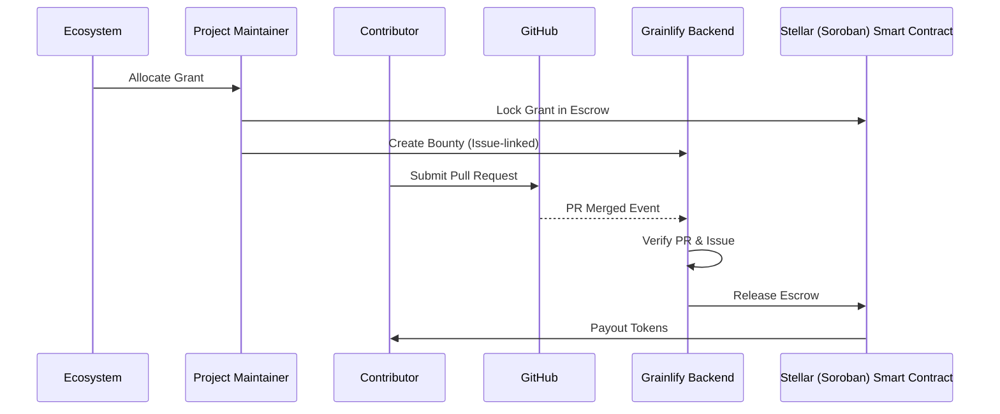
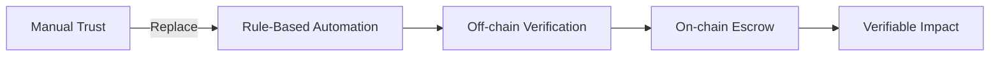

## 🧱 Build

**Grainlify is a grant execution layer for open-source ecosystems.**

Open-source funding today is largely manual and trust-based. Ecosystems allocate grants, projects manage funds off-chain, and contributors often wait for subjective approvals and delayed payouts. Grainlify fixes the execution problem by ensuring that **real work leads to automatic rewards**.

Ecosystems fund programs (hackathons, quests, grant rounds).

Selected projects receive grant allocations.

Project maintainers lock these grants into **on-chain escrow smart contracts on Stellar (Soroban)** and create bounties linked to GitHub issues.

Contributors work normally on GitHub. When a pull request is reviewed and merged, Grainlify verifies the contribution off-chain using GitHub events and **automatically triggers an on-chain payout** from escrow to the contributor’s wallet.

We intentionally use **minimal on-chain logic**:

- Smart contracts act only as secure, non-custodial vaults
- Verification and coordination remain off-chain for efficiency

This guarantees:

- Funds are locked before work begins
- Payouts are rule-based and merge-triggered
- Ecosystems gain verifiable proof of impact
- Contributors are paid fairly and instantly

Grainlify does not decide *who* gets funded.

It guarantees *how* funding is executed.

---

## 🔄 High-Level System Architecture

```mermaid
flowchart TB
    Ecosystem[Ecosystem] -->|Grant Funds| Program[Program]
    Program -->|Grant Allocation| Project[Project]
    Project -->|Lock Funds| Escrow[Stellar (Soroban) Escrow Contract]
    Contributor[Contributor] -->|PR / Issues| GitHub[GitHub]
    GitHub -->|Events| Backend[Grainlify Backend]
    Backend -->|Verify PR & Issue| Verification[Off-chain Verification]
    Verification -->|Trigger Release| Escrow
    Escrow -->|Payout| Contributor
```

## 🔐 Grant → Bounty → Payout Flow



## 🧠 Design Philosophy



## 🏁 Summary

Grainlify turns ecosystem grants into automatic, verifiable payments for open-source contributions, using Stellar as the settlement layer and GitHub as the source of truth for real work.

